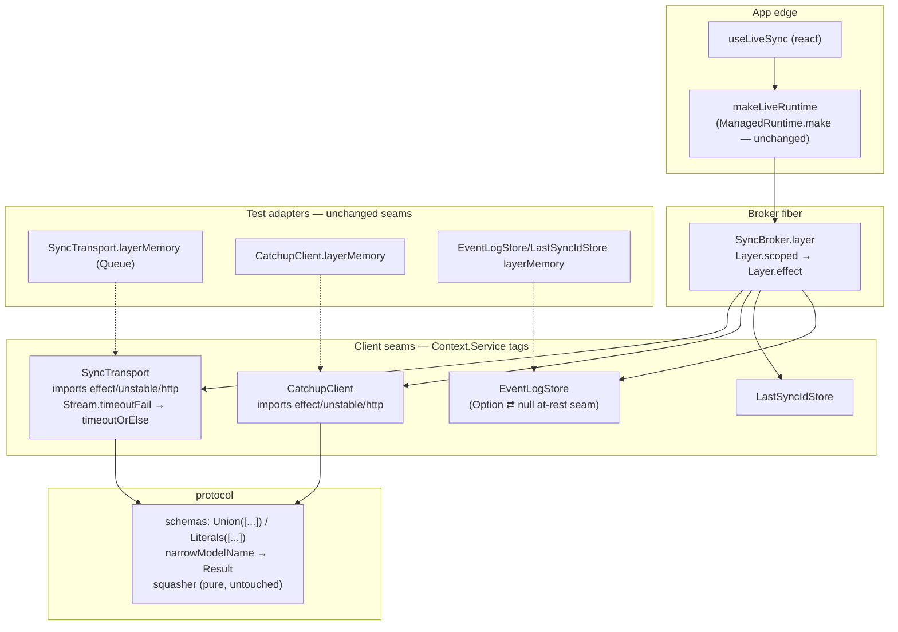

# Effect v4 Migration

Migrate the whole workspace (3 packages + playground + pi-demo) from Effect v3 to Effect v4 in one stroke, swap `CLAUDE.md` for a pruned `AGENTS.md`, and update `docs/*.md` snippets at rename level.

**Locked decisions (from the design conversation):**

| # | Decision |
|---|----------|
| D1 | Pin `effect` / `@effect/vitest` / `@effect/platform-node` at **`^4.0.0-beta.98`** (caret within beta — floats across `4.0.0-beta.*` and onto `4.0.0` final). |
| D2 | `@effect/platform` is **dropped everywhere**; HTTP client imports come from **`effect/unstable/http`** directly, confined to the two existing adapter files (`sync-transport.ts`, `catchup-client.ts`) + app-edge wiring. No extra wrapper. |
| D3 | `narrowModelName` public signature: mechanical swap **`Either.Either<N, UnknownModelError>` → `Result.Result<N, UnknownModelError>`** — same semantics, `Result.match` at call sites. |
| D4 | `CLAUDE.md` → **`AGENTS.md`** (real file, no symlink, `CLAUDE.md` deleted), pruned per the agreed stays/cuts list. |
| D5 | `docs/*.md` get rename-level churn only (backend team copy-pastes protocol snippets); README/spec untouched unless a snippet is agent-steering. |
| D6 | All packages + examples move together — v3/v4 cannot coexist in one type graph. |

---

## 1. Interface changes (the only real API surface that moves)

### 1.1 Service tags — every `Context.Tag` class becomes `Context.Service`

The `<Name>Shape` pattern survives verbatim; only the tag incantation changes:

```ts
// v3 (current)
export class SyncTransport extends Context.Tag("SyncTransport")<SyncTransport, SyncTransportShape>() {}

// v4
export class SyncTransport extends Context.Service<SyncTransport, SyncTransportShape>()("SyncTransport") {}
```

Statics (`layer`, `layerMemory`, `layerFromEnv`) keep their exact signatures. Files (12 tags):

- `packages/live-collection/src/client/`: `SyncTransport`, `CatchupClient`, `LastSyncIdStore`, `EventLogStore`, `SyncBroker`
- `packages/live-collection/src/registry/collection-registry.ts`: `CollectionRegistry`
- `packages/live-collection/test/write-path.integration.test.ts`: test-local tag
- `examples/pi-demo/server/src/`: `ProjectRepo`, `TodoRepo`, `SyncDispatcher`, `SyncEventBus`, `SyncEventStore`
- `examples/pi-demo/shared/src/api.ts`: `CurrentSession`
- `examples/playground/src/live/shared-backend.ts`: playground tag

### 1.2 `protocol` public API — the one breaking contract-kit change

```ts
// packages/protocol/src/model-registry.ts

// v3 (current)
export const narrowModelName = <N extends ModelName>(
  known: ReadonlyArray<N>, name: ModelName,
): Either.Either<N, UnknownModelError>

// v4 (locked, D3)
export const narrowModelName = <N extends ModelName>(
  known: ReadonlyArray<N>, name: ModelName,
): Result.Result<N, UnknownModelError>
// body: Either.right → Result.succeed, Either.left → Result.fail
```

Tagged errors package-wide: `Schema.TaggedError<Self>()(tag, fields)` → `Schema.TaggedErrorClass<Self>()(tag, fields)` (same curried shape — `UnknownModelError`, `SyncConnectionLost`, `CatchupFailed`, define-collection error, pi-demo `UnauthorizedError`/`ProjectNotFound`/`TodoNotFound`, playground error).

Wire-schema semantics fix (protocol): **v3 `Schema.Date` = string ⇄ Date transform; v4 `Schema.Date` = Date instance only.** The wire carries ISO strings, so:

```ts
// packages/protocol/src/sync-event.ts — 3 occurrences
createdAt: Schema.Date          // v3
createdAt: Schema.DateFromString // v4 — preserves the wire format exactly
```

### 1.3 `LiveRuntime` — type-level rename only

`Fiber.RuntimeFiber<void>` no longer exists; v4 has one `Fiber.Fiber<A, E>` type with `pollUnsafe()` built in:

```ts
export interface LiveRuntime {
  readonly registry: CollectionRegistryShape
  readonly persistence: PersistedCollectionPersistence
  readonly forkSync: () => Fiber.Fiber<void>          // was Fiber.RuntimeFiber<void>
  readonly forkDrain: (drain: Effect.Effect<void, never, SyncBroker>) => Fiber.Fiber<void>
  readonly dispose: () => void
}
```

Callers (`useLiveSync` in `react`, playground, pi-demo web) are shape-compatible — `Fiber.interrupt` still exists. `syncFiber.unsafePoll() === null` → `syncFiber.pollUnsafe() === undefined` (v4 returns `Exit | undefined`, not `Exit | null`).

No other public interface in any package changes shape.

---

## 2. Call graph (unchanged topology, renamed edges)

The migration deliberately preserves every seam; this is the existing production/test graph with the renamed APIs annotated:



Nothing gains or loses an adapter; every seam keeps ≥2 (prod + memory). This is a rename migration, not a redesign — no new tests are written, the existing suites are the acceptance gate.

---

## 3. Mechanical rename map (verified against effect-smol @ 4.0.0-beta.98)

Applied repo-wide (packages + examples + tests):

| v3 | v4 | ~count |
|---|---|---|
| `Context.Tag("X")<X, Shape>()` | `Context.Service<X, Shape>()("X")` | 12 |
| `Schema.TaggedError<S>()(...)` | `Schema.TaggedErrorClass<S>()(...)` | 8 |
| `Effect.zipRight` | `Effect.andThen` | 32 |
| `Scope.extend(eff, scope)` | `Scope.provide(scope)(eff)` / `Scope.provide(eff, scope)` | 8 |
| `Scope.fork(s, ExecutionStrategy.sequential)` | `Scope.fork(s, "sequential")` (+ drop `ExecutionStrategy` import) | 1 |
| `Scope.CloseableScope` | `Scope.Closeable` | 2 |
| `Layer.scoped` | `Layer.effect` | 3 |
| `Effect.fork` | `Effect.forkChild` | 2 |
| `Effect.catchAll` | `Effect.catch` | 2 |
| `Effect.either` | `Effect.result` (result type is `Result`, match accordingly) | 2 |
| `Either.*` (protocol + pi-demo + tests) | `Result.*` (`right→succeed`, `left→fail`, `isRight→isSuccess`, `isLeft→isFailure`, `.right→.success`, `.left→.failure`) | 10 sites |
| `Deferred.unsafeDone` | `Deferred.doneUnsafe` | 1 |
| `fiber.unsafePoll() === null` | `fiber.pollUnsafe() === undefined` | 1 |
| `Fiber.RuntimeFiber<A>` | `Fiber.Fiber<A>` | 3 |
| `Exit.isInterrupted` | `Exit.hasInterrupts` | 1 |
| `Schema.decode` / `Schema.encode` | `Schema.decodeEffect` / `Schema.encodeEffect` | 12 |
| `Schema.decodeUnknown` | `Schema.decodeUnknownEffect` | 13 |
| `Schema.decodeUnknownEither` | `Schema.decodeUnknownResult` | 2 |
| `Schema.parseJson(schema)` | `Schema.fromJsonString(schema)` | 8 |
| `Schema.Union(A, B, ...)` | `Schema.Union([A, B, ...])` | 7 |
| `Schema.Literal("a", "b")` (multi-arg) | `Schema.Literals(["a", "b"])` | 2 |
| `Schema.filter(pred, ann)` | `.check(Schema.makeFilter(pred, ann))` | 1 (SyncGroup) |
| `Schema.pattern(re)` | `.check(Schema.isPattern(re))` | 2 (SyncId, SessionCode) |
| `Schema.Date` (wire) | `Schema.DateFromString` | 3 |
| `Schema.annotations({...})` | `Schema.annotate({...})` | 3 |
| `Stream.timeoutFail(() => e, d)` | `Stream.timeoutOrElse(self, { duration, orElse: () => Stream.fail(e) })` | 1 |
| `Effect.timeoutFail({ duration, onTimeout })` | `Effect.timeoutOrElse({ duration, orElse: () => Effect.fail(...) })` | 11 (tests) |
| `Duration.DurationInput` | `Duration.Input` | few |
| `import { FastCheck } from "effect"` | `import * as fc from "effect/testing/FastCheck"` (or barrel `effect/testing`) | 2 |
| `import { TestClock } from "effect"` | `from "effect/testing"` | 1 |
| `import type { NonEmptyReadonlyArray } from "effect/Array"` | unchanged (module survives) | — |
| `from "@effect/platform"` → `HttpClient`, `HttpClientResponse`, `FetchHttpClient` | `from "effect/unstable/http"` | 5 files |
| `from "@effect/platform"` → `HttpApi*`, `OpenApi` | `from "effect/unstable/httpapi"` | pi-demo |
| `HttpLayerRouter` | `HttpRouter` (`effect/unstable/http`) — v4 merged the layer-router API into `HttpRouter` (`add`/`serve` shapes verified) | pi-demo server |
| `NodeContext.layer` | `NodeServices.layer` (`@effect/platform-node`) | 1 |
| `Schema.TaggedStruct`, `Schema.brand`, `Schema.NonEmptyString/NonEmptyArray`, `Schema.OptionFromNullOr`, `Schema.decodeUnknownOption/Sync`, `ManagedRuntime.make`, `Queue.*`, `PubSub.*`, `Stream.fromQueue`, `Exit.void`, `Order.max/mapInput`, `Config.string/withDefault`, `Layer.mergeAll/merge/provideMerge/unwrapEffect→unwrap` | survive (verified in v4 source) | — |

**Known judgment sites (not pure rename — handle individually):**

1. **`Chunk.toReadonlyArray(taken)`** in tests: v4 `Stream.runCollect` returns `Array<A>` directly; `Queue.takeAll` returns arrays. Drop the `Chunk` wrapper where the producer no longer yields Chunk (5 sites).
2. **Yieldable sweep**: any bare `yield* fiber` / `yield* deferred` / `yield* ref` must become `Fiber.join` / `Deferred.await` / `Ref.get`. Current code already uses the explicit forms almost everywhere — verify during typecheck.
3. **pi-demo `HttpApiEndpoint` DSL**: v4 replaced the builder chain (`.setPayload/.setPath/.setUrlParams/.addSuccess/.addError`) with an options object: `HttpApiEndpoint.get("list", "/todos", { success: Schema.Array(Todo) })`, `del("remove", "/projects/:id", { params: { id: ProjectId }, error: ProjectNotFound })`. `HttpApiMiddleware.Tag` → `HttpApiMiddleware.Service`. `HttpApiSchema.annotations({ status })` → `HttpApiSchema.status(404)(schema)` piped onto the error schema. This is the largest single restructuring, confined to `examples/pi-demo/shared/src/api.ts` + `server/src/http/*`.
4. **`Layer.unwrapEffect`** (2 sites) → `Layer.unwrap`.
5. **`@effect/vitest` v4**: `it.effect`/`it.live`/`it.scoped` and `assert` re-export survive (verified in v4 vitest source); `it.effect` now auto-provides TestClock + TestConsole — the sync-broker TestClock tests keep working.

---

## 4. Work packages (bottom-up along the DAG)

Each step ends with `pnpm -r typecheck` + the affected package's tests green before moving on.

### WP0 — Dependency bump
- Root + all `package.json`: `effect: ^4.0.0-beta.98`, `@effect/vitest: ^4.0.0-beta.98`.
- Remove `@effect/platform` from `packages/live-collection` deps; pi-demo server swaps `@effect/platform` + `@effect/platform-node` → `@effect/platform-node@^4.0.0-beta.98` only; pi-demo web/shared drop `@effect/platform`.
- `pnpm install`. (Requires your go-ahead at execution time — package installs are outside my unprompted command set.)

### WP1 — `packages/protocol`
- Rename map + `Union([...])`/`Literals([...])`/`check(...)` restructures + `DateFromString` + `narrowModelName` → `Result` + `TaggedErrorClass`.
- Tests: `decodeUnknownEither` → `decodeUnknownResult`, `Either` asserts → `Result`, FastCheck import path.
- Gate: `pnpm --filter @triargos/live-collection-protocol typecheck && test`.

### WP2 — `packages/live-collection`
- All 6 tags → `Context.Service`; `effect/unstable/http` imports in the two adapters; `Stream.timeoutOrElse` in SyncTransport; `Layer.scoped→effect`; `Scope`/`Fiber`/`Deferred`/`Exit` renames; `live-runtime.ts` fiber-type + poll changes; test suite renames (`Effect.timeoutOrElse`, Chunk drops, `Exit.hasInterrupts`).
- Gate: package typecheck + tests.

### WP3 — `packages/react`
- `Fiber.RuntimeFiber` type reference only (via `LiveRuntime`); likely zero source edits beyond none. Gate: typecheck + type-tests.

### WP4 — `examples/playground`
- Shared-backend tag + `TaggedErrorClass` + decode/encode renames + `Effect.either→result`; browser tests (`Effect.timeoutOrElse`). Gate: typecheck + `pnpm --filter playground test` (browser suites via playwright).

### WP5 — `examples/pi-demo`
- Shared: `HttpApi` options-object DSL restructure, `HttpApiMiddleware.Service`, `HttpApiSchema.status`, `TaggedErrorClass`, tag rename.
- Server: `HttpLayerRouter→HttpRouter`, `NodeContext→NodeServices`, `Layer.unwrap`, `Either→Result`, `Effect.catchAll→catch`.
- Web: `FetchHttpClient`/`HttpApiClient` import paths, `decodeUnknownOption` (survives).
- Gate: typecheck + server tests (incl. e2e/sse).

### WP6 — `AGENTS.md` + docs
- **Delete `CLAUDE.md`, create `AGENTS.md`** with the agreed prune:
  - **Stays:** repo header + spec pointer; architecture block (packages, split rationale, DAG — with `@effect/platform` line replaced by "`effect/unstable/http` confined to `sync-transport.ts` / `catchup-client.ts` (D2)"); decisions 1–11 with **decision 6 rewritten**: `Context.Service<Self, Shape>()("Name")`, `<Name>Shape`, separate `make`, `layer`/`layerMemory`/`layerFromEnv` statics, explicit "no `Live` suffix — intentional divergence from the global convention"; anti-references; test layout block (sibling `test/`, `tsconfig.test.json`, bare-`vitest` footgun, squasher property tests, `assert`-not-`expect`, FastCheck now `effect/testing/FastCheck`); repo-specific boundary rules (decode wire payloads via protocol schemas; `EventLogStore` as the `Option ⇄ null` seam); commands; new short **Effect v4 notes** section (beta pin policy `^4.0.0-beta.98`, `Result` not `Either` in protocol public API, unstable-http containment).
  - **Cuts:** generic design-first walkthrough, generic no-throw/Option/validation prose, v3 `Context.Tag` incantation + `Effect.Service`-is-legacy framing, generic test-framework table, object-args rule.
- **`docs/*.md` rename-level pass** (`backend.md`, `protocol.md`, `optimistic-writes.md`, `architecture.md`, `collections.md`, plus grep the rest): `Context.Tag` snippet → v4 form, `Schema.TaggedError` → `TaggedErrorClass`, `Either.match(narrowModelName(...))` → `Result.match`, `@effect/platform` import lines → `effect/unstable/http`.

### WP7 — Full gate
- `pnpm -r typecheck` and `pnpm -r test` at the root; report each with observed exit codes (PASS/FAIL/UNVERIFIED discipline).

## Out of scope
- No seam redesigns, no new tests, no `pnpm -r build`/publish, no README/`live-sync-system.md` rewrites beyond snippets that would actively mislead an agent.

## Risks
- **Beta drift**: `^4.0.0-beta.98` may pull a newer beta at install time with additional renames — handled at typecheck, same discipline.
- **pi-demo HttpApi DSL**: the endpoint options-object shapes are verified against v4 source/tests, but this is the area most likely to need iteration during WP5.
- **TanStack DB interplay**: `liveCollectionOptions`/persistence code doesn't touch Effect types at the TanStack boundary, so no cross-risk expected; WP2's write-path integration tests are the guard.
