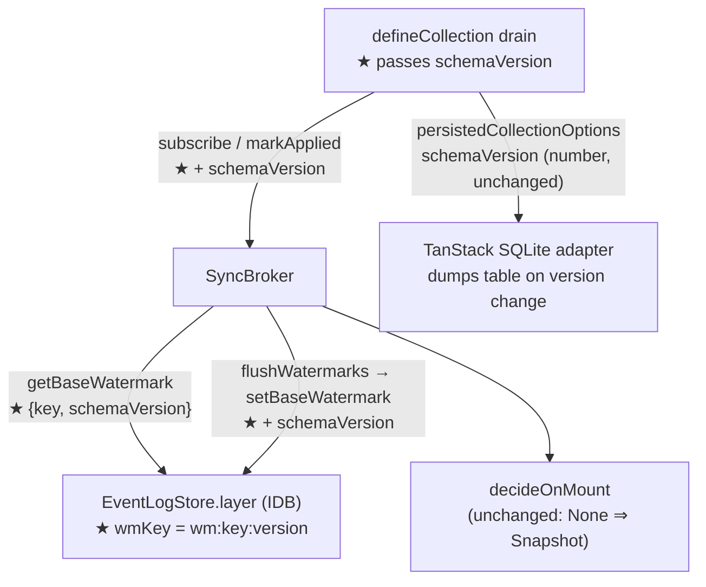

# Versioned base watermark — heal the schema-dump / watermark split-brain

## Problem

The persisted local base (TanStack SQLite table, keyed by `schemaVersion`) and the
freshness metadata (`wm:<key>` base watermark in the `EventLogStore`) have **no shared
invalidation**. When `schemaVersion` changes, TanStack drops and rebuilds the table
(`sqlite-core-adapter.js:1348`), but the watermark survives in IDB — so `decideOnMount`
returns `Skip`/`Replay` against an **empty** base, and the tail guard drops every event
`<= head` as "already applied". The collection is silently frozen until IDB is cleared.

The Effect v4 migration exposed this everywhere at once (the schema-version hash input
changed from `String(schema.ast)` to `JSON.stringify(SchemaRepresentation.fromAST(ast))`,
flipping every collection's version), but any app-level schema change triggers the same
freeze for that collection. It's a latent library bug.

## Locked design: fold `schemaVersion` into the watermark identity

A watermark is only meaningful **for the base it describes**. The base's identity is
`(collection key, schemaVersion)` — so the watermark key becomes exactly that. A version
change orphans the old watermark; `getBaseWatermark` finds `None`; `decideOnMount`
returns `Snapshot`; the drain re-lists and rebuilds — self-healing, no reactive coupling
to persistence internals (AGENTS.md decision #3: persistence stays behind its seam).

Rejected alternative: listening for the adapter's `collection:reset` broadcast and
clearing the watermark reactively — couples the broker to persistence internals across
the containment seam, and is racy (broadcast vs. mount ordering).

## Interface changes (signatures only)

### `SchemaVersion` branded scalar — `packages/live-collection/src/persistence/schema-version.ts`

The version currently travels as a raw `number`. It becomes a branded scalar since it now
crosses two seams (persistence config and event-log watermark identity):

```ts
export const SchemaVersion = Schema.Number.pipe(Schema.brand("SchemaVersion"))
export type SchemaVersion = typeof SchemaVersion.Type

export const deriveSchemaVersion: (schema: Schema.Top) => SchemaVersion
```

TanStack's `persistedCollectionOptions` takes a plain `number`; the brand widens
implicitly at that call site — no cast needed.

Also: rewrite the "harmless refetch" paragraph of the doc comment to state the real
invariant — a version change dumps the persisted base **and** (via the versioned
watermark key) orphans the base watermark, forcing a fresh `Snapshot` on next mount.

### `EventLogStoreShape` — `packages/live-collection/src/client/event-log-store.ts`

```ts
readonly getBaseWatermark: (args: {
  readonly key: CollectionKey<unknown>
  readonly schemaVersion: SchemaVersion
}) => Effect.Effect<Option.Option<SyncId>>

readonly setBaseWatermark: (args: {
  readonly key: CollectionKey<unknown>
  readonly schemaVersion: SchemaVersion
  readonly at: SyncId
}) => Effect.Effect<void>
```

- IDB adapter: `wmKey` becomes `` `wm:${serializeKey(key)}:${schemaVersion}` ``.
- Memory adapter: same composite string keys its `watermarks` map.
- Old un-versioned / other-version `wm:` entries are inert garbage (bounded: one per
  collection per schema change). No sweep in this change — noted as future `prune` work.
- No IDB database-version bump: the `meta` store is keyval, only key *format* changes.

### `SyncBrokerShape` — `packages/live-collection/src/client/sync-broker.ts`

`schemaVersion` threads through both public methods; `PendingWatermark` carries it too so
the flush loop can call the new `setBaseWatermark`:

```ts
readonly subscribe: (args: {
  readonly modelName: ModelName
  readonly scope: Option.Option<string>
  readonly schemaVersion: SchemaVersion
}) => Stream.Stream<SyncSignal>

readonly markApplied: (args: {
  readonly modelName: ModelName
  readonly scope: Option.Option<string>
  readonly schemaVersion: SchemaVersion
  readonly through: SyncId
}) => Effect.Effect<void>

type PendingWatermark = {
  readonly key: CollectionKey<unknown>
  readonly schemaVersion: SchemaVersion
  readonly at: SyncId
}
```

The `pending` map's string key becomes the same composite (`serializeKey(key)` +
version), so pending-watermark lookups in `subscribe` stay consistent with the durable
lookup. `decideOnMount` is unchanged — the fix is entirely in what `baseWatermark`
resolves to.

### `defineCollection` — `packages/live-collection/src/registry/define-collection.ts`

Already computes `schemaVersion = deriveSchemaVersion(schema)` at define time. The drain
passes it along:

```ts
const applied = (through: SyncId) =>
  broker.markApplied({ modelName, scope: key.scope, schemaVersion, through })
yield* Stream.runForEach(
  broker.subscribe({ modelName, scope: key.scope, schemaVersion }),
  ...
)
```

No public API change for apps — `defineCollection`'s config is untouched.

## Call graph

Production (change sites marked ★):



Schema change flow after the fix: version flips → TanStack dumps the table **and** the
broker reads `wm:<key>:<newVersion>` = `None` → `decideOnMount` = `Snapshot` → drain
re-lists via `listFn` → base and watermark rebuilt consistently.

Test: same seams, `EventLogStore.layerMemory` behind the broker
(`packages/live-collection/test/sync-broker.test.ts`), real IDB in
`examples/playground/test/event-log-store.browser.test.ts`, and the end-to-end drain in
`test/sync-drain.integration.test.ts` via `layerMemory` + node SQLite persistence.

## Error channels / domain types

No new failure modes: watermark methods stay `Effect<..., never>` (driver faults remain
defects, per the existing adapter contract). The only new domain type is the
`SchemaVersion` brand.

## Test plan (behavior, through public seams)

1. **New regression test** (`sync-broker.test.ts`): subscribe with version A, mark
   applied through `"10"`, flush; re-subscribe with version B → first signal is
   `Snapshot`, and catchup events ≤ 10 are **not** dropped by the tail guard. This is the
   bug reproduced.
2. **Same-version path unchanged**: existing skip/replay tests updated mechanically to
   pass a fixed `schemaVersion` — assertions untouched.
3. **IDB adapter** (`event-log-store.browser.test.ts`): watermark written under version A
   is invisible under version B; still monotonic within one version; survives reload.
4. **Drain integration** (`sync-drain.integration.test.ts`): existing tests updated only
   where they call broker methods directly (they don't — they go through
   `defineCollection`, so no change expected).

## Files touched

| File | Change |
| --- | --- |
| `src/persistence/schema-version.ts` | `SchemaVersion` brand, return type, doc-comment fix |
| `src/client/event-log-store.ts` | watermark method signatures, both adapters' key format |
| `src/client/sync-broker.ts` | thread `schemaVersion` through `subscribe`/`markApplied`/`PendingWatermark`/flush |
| `src/registry/define-collection.ts` | pass `schemaVersion` in the drain's two broker calls |
| `test/sync-broker.test.ts` | fixed version in helpers + new regression test |
| `test/schema-version.test.ts` | brand-compatible assertions (values unchanged) |
| `examples/playground/test/event-log-store.browser.test.ts` | versioned watermark cases |

## Validation

`pnpm --filter @triargos/live-collection typecheck && pnpm --filter @triargos/live-collection test`,
then root `pnpm -r typecheck` and `pnpm -r test`. Playground browser tests require
Playwright Chromium — run `pnpm playground` tests only if the environment supports it;
otherwise report UNVERIFIED for that suite.
